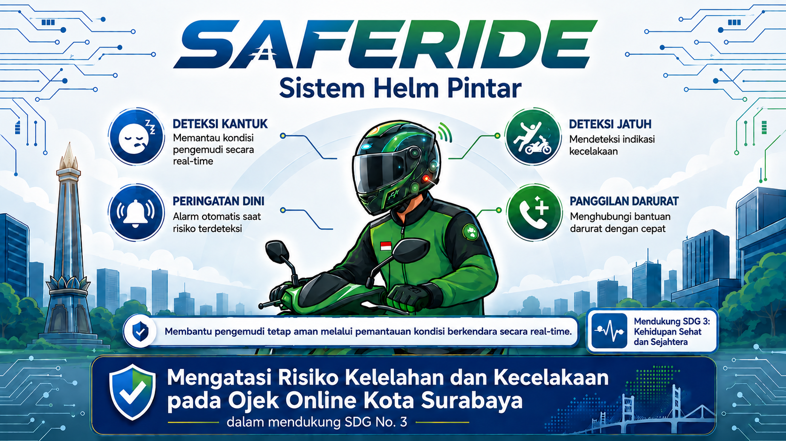
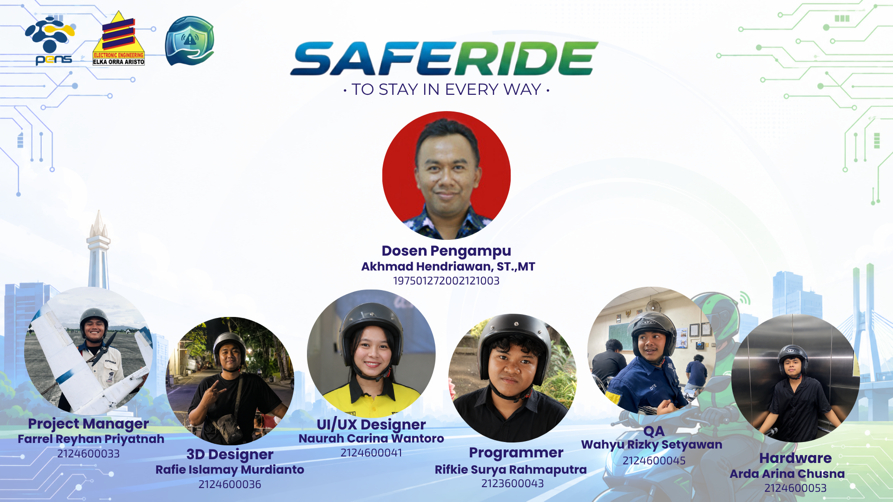

# SafeRide: Sistem Helm Pintar guna Keselamatan Berkendara Berbasis ATmega2560 untuk Mengatasi Risiko Kelelahan dan Kecelakaan pada Ojek Online Kota Surabaya dalam Mendukung SDGs No. 3 Kehidupan Sehat dan Sejahtera

> **Sering merasa lelah, mengantuk, atau khawatir dengan risiko tak terduga saat membelah jalanan kota?** 

Bagi para pejuang jalanan khususnya rekan-rekan **Ojek Online di Kota Surabaya** yang setiap hari menantang padatnya lalu lintas dengan mobilitas super tinggi keselamatan adalah taruhan utama. Di sinilah **SafeRide** hadir membawa perubahan! Kami mendefinisikan ulang fungsi helm pelindung: dari sekadar alat pasif penahan benturan, menjadi **Asisten Keselamatan Aktif berbasis IoT** yang cerdas dan responsif. Dengan SafeRide, kamu tidak lagi berkendara sendirian. Kami mengintegrasikan teknologi mikrokontroler demi memastikan kamu berangkat produktif, dan **pulang ke rumah dengan selamat**. 

*Bersama SafeRide, mari buat perjalanan menjadi lebih aman, tenang, dan terlindungi di setiap kilometer!* 🏁🛡️

---

## 🎯 Tujuan Proyek

1. **Implementasi Sistem Deteksi Kantuk (Anti-Nodding):** Memanfaatkan sensor IMU untuk mendeteksi perubahan orientasi atau gerakan kepala berulang ke arah depan secara tidak wajar yang menjadi indikasi mikro-tidur (*micro-sleep/nodding*).
   
2. **Implementasi Sistem Fall Detection:** Mengintegrasikan data percepatan linier 3-sumbu dari akselerometer dan kecepatan sudut dari giroskop untuk mendeteksi deviasi kemiringan ekstrem dan hentakan kinetik secara *real-time* saat terjadi kecelakaan.

3. **Early Warning System (Feedback Motor Vibrator & Buzzer):** Memberikan respons peringatan instan kepada pengendara yang terindikasi mengantuk berupa getaran melalui *Vibration Motor & Buzzer* yang dikendalikan via pin PWM (Pulse Width Modulation) ATmega2560.
   
4. **Sistem Darurat Terintegrasi Server & Manual Trigger:** Mengirimkan data telemetri dan sinyal bahaya secara otomatis ke *server* ketika insiden jatuh terkonfirmasi. Menyediakan Tombol Manual Darurat (*Emergency Button*) pada helm sebagai cadangan (*redundancy system*) jika sistem otomatis gagal mendeteksi atau dalam kondisi bahaya lainnya.

### 🏫 Supported By

* **Dosen Pengampu:** Akhmad Hendriawan ST., MT. (NIP. 197501272002121003)
* **Mata Kuliah:** Mikrokontroler
* **Program Studi:** D4 Teknik Elektronika
* **Institusi:** Politeknik Elektronika Negeri Surabaya

---

## 👥 Anggota Tim

| NRP | Nama | Jobdesk | Akun |
| :--- | :--- | :--- | :--- |
| 2124600033 | Farrel Reyhan Priyatnah | Project Manager | [farrelrey](https://github.com/farrelrey) |
| 2124600036 | Rafie Islamay Murdianto | 3D Designer| [RafieIslamay](https://github.com/rafieislamaym-blip) |
| 2123600043 | Rifkie Surya Rahmaputra | Progammer | [RifkieSurya](https://github.com/Rifkiesurya44) |
| 2124600053 | Arda Arinal Chusna | Hardware | [ArdaArinal](https://github.com/ardaarinalc-ux) |
| 2124600041 | Naurah Carina Wantoro | UI/UX Designer | [NaurahCarina](https://github.com/NaurahCarinaW) |
| 2124600045 | Wahyu Rizky Setyawan | QA | [WahyuSetyawan](https://github.com/wahyusetiyawan71-glitch) |
---
## 🛠️ Komponen 
1. **Arduino Mega (ATmega2560):** Otak utama sistem yang berfungsi memproses seluruh data dari sensor dan mengendalikan modul keluaran secara cepat dan efisien.
2. **Sensor IMU MPU6050 (Gyroscope + Accelerometer):** Sensor inersia presisi tinggi yang bertugas membaca orientasi, tingkat kemiringan helm, dan mendeteksi gerakan mengangguk (*nodding*) saat mengantuk maupun kondisi ekstrem saat terjatuh.
3. **Motor Vibrator:** Modul aktuator yang memberikan respons getaran instan langsung ke helm sebagai peringatan taktil agar pengendara segera terjaga saat terdeteksi *micro-sleep*.
4. **Buzzer:** Output peringatan suara (*auditory alert*) yang bekerja bersamaan dengan vibrator untuk memberikan alarm peringatan ganda saat kondisi darurat.
5. **Panic Button Switch:** Tombol darurat fisik yang ditempatkan pada posisi strategis helm sebagai pemicu manual (*manual trigger*) untuk mengirim sinyal bahaya ke server dalam kondisi darurat lainnya.

